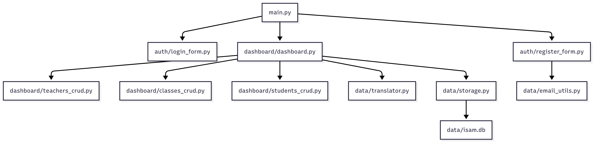
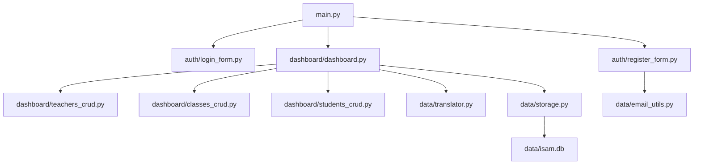

# Introducción

Este proyecto es una aplicación de escritorio para la gestión escolar de ISAM, desarrollada en Python usando PyQt5 y SQLite3. Permite gestionar profesores, clases y alumnos, soporta multi-idioma y utiliza JWT para autenticación.

## ¿A quién va dirigido este instructivo?
A personas con conocimientos básicos de Python que desean entender cómo crear una aplicación de escritorio moderna, con interfaz gráfica, persistencia en base de datos y buenas prácticas de organización de código.

## Novedades principales (2025)
- Registro de usuarios con validación por correo electrónico y token de confirmación.
- Envío de correos SMTP (Mailtrap) para confirmar registro.
- Validación de unicidad de correo y expiración de token (24h).
- Pantalla de confirmación de registro integrada en la app.

## Estructura general del proyecto

- **main.py**: Punto de entrada de la app.
- **auth/**: Formularios de login y registro (con confirmación por email).
- **dashboard/**: Pantalla principal y CRUDs.
- **data/**: Persistencia, traducción, autenticación y envío de correos.
- **resources/**: Imágenes, estilos y archivos de idioma.

Continúa con los siguientes archivos para ver detalles de cada módulo.
