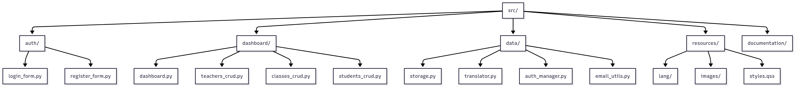
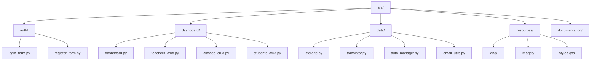

# Estructura del Proyecto

La aplicación está organizada en carpetas según su función. Esto facilita el mantenimiento y la escalabilidad.

- **auth/**: Login y registro de usuarios (con confirmación por email).
- **dashboard/**: Pantalla principal y gestión de entidades.
- **data/**: Persistencia (SQLite3), traducción, autenticación y envío de correos.
- **resources/**: Archivos de idioma, imágenes y estilos.
- **documentation/**: Instructivos y diagramas.

Cada módulo tiene responsabilidades claras y se comunica con los demás mediante clases y métodos bien definidos.
