# Flujo de la Aplicación

A continuación se describe el flujo principal de la aplicación desde el inicio hasta la gestión de datos y el registro de usuarios.

## Diagrama de flujo principal

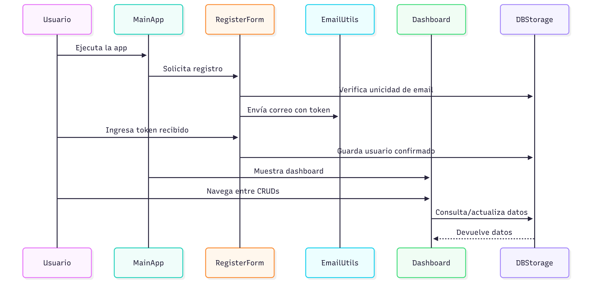

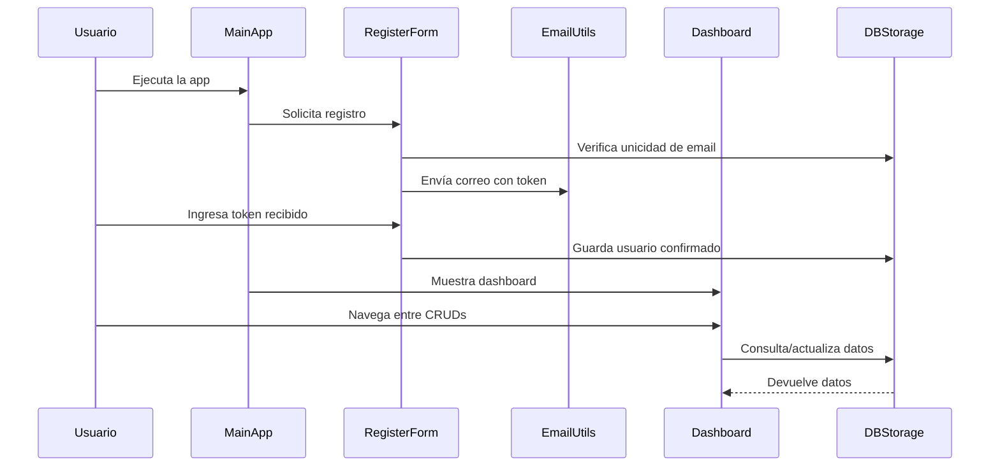

## Funcionalidades y pantallas principales

- **Login:** Pantalla de acceso al sistema.
  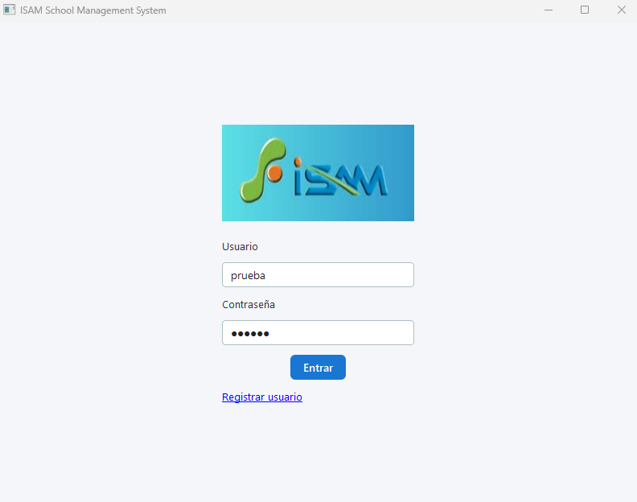

- **Registro de usuario:** Permite crear una cuenta, solicita usuario, contraseña y correo electrónico.
  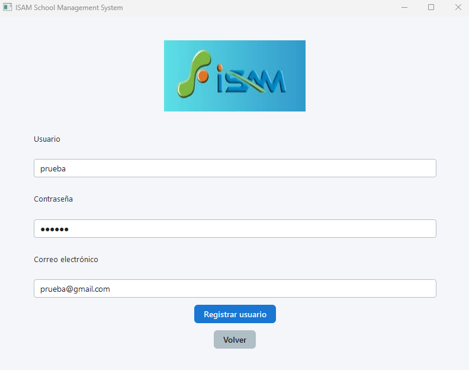

- **Correo de confirmación:** El usuario recibe un correo con un código de confirmación para activar su cuenta.
  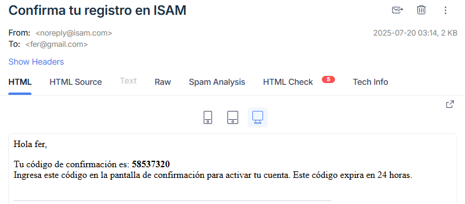

- **Pantalla de confirmación:** El usuario ingresa el código recibido para activar su cuenta.
  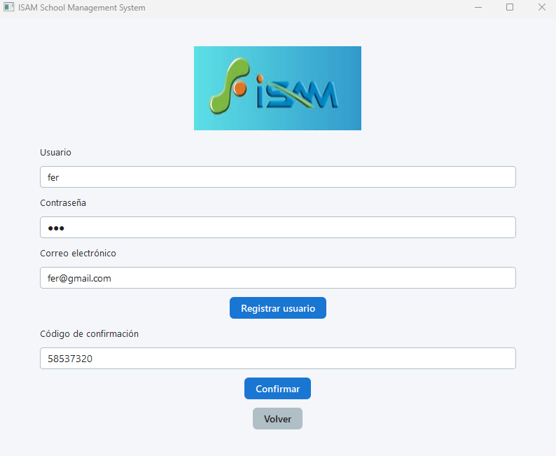

- **Notificación de activación:** Mensaje visual tras enviar el correo de activación.
  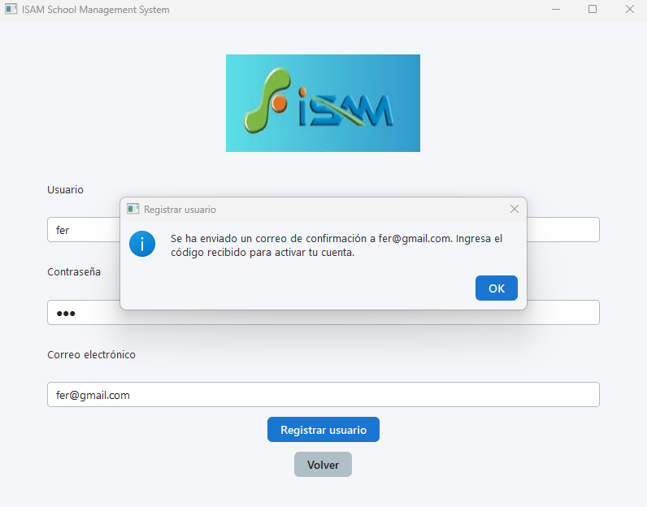

- **Dashboard:** Vista principal tras el login, con acceso a los CRUDs y visualización de estadísticas.
  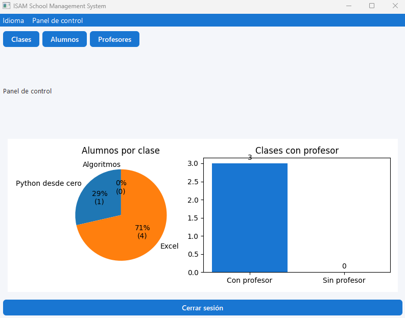

- **Gestión de profesores, alumnos y clases:** CRUDs para cada entidad.
  - Profesores: 
  - Alumnos: 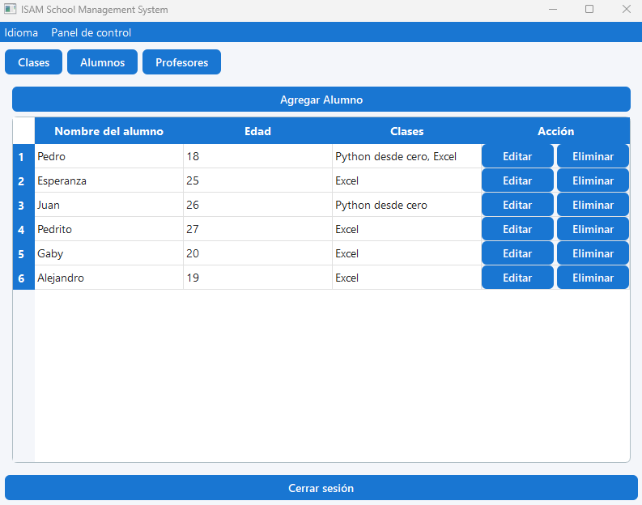
  - Clases: 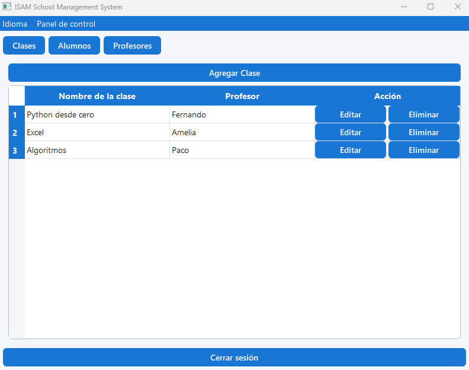

- **Edición y registro de entidades:** Formularios para agregar o editar profesores, alumnos y clases.
  - Registrar/Editar Profesor: 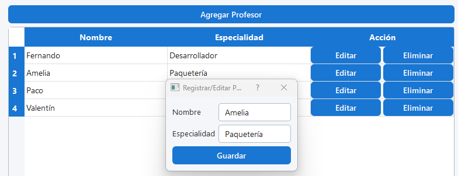
  - Registrar/Editar Alumno: 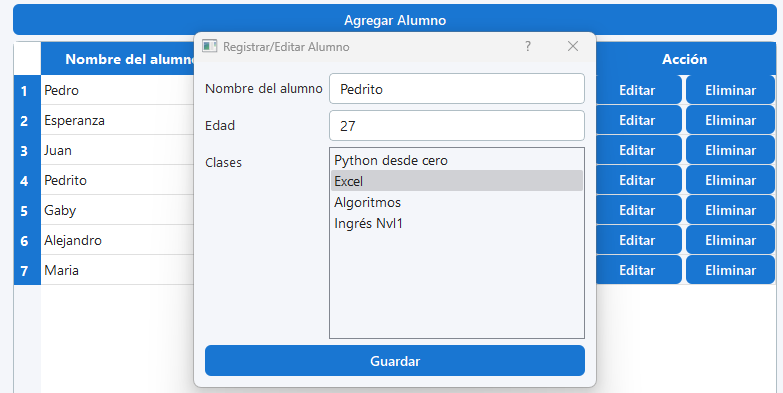
  - Registrar/Editar Clase: 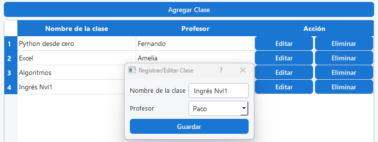

- **Cambio de idioma:** Permite alternar entre español e inglés desde el menú.
  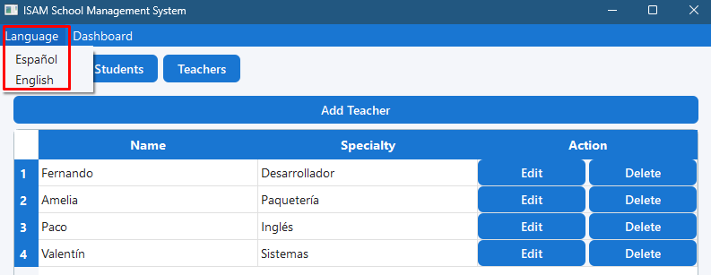

- **Notificación de eliminación:** Mensaje visual al eliminar registros en los CRUDs.
  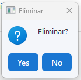

Cada pantalla está diseñada para ser intuitiva y guiar al usuario en el flujo de registro, confirmación y gestión escolar.
