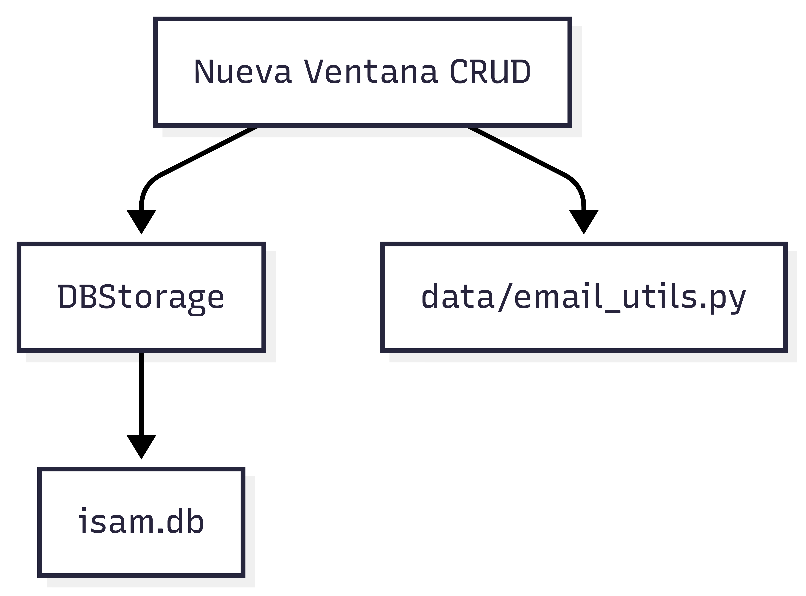

# ¿Cómo extender la aplicación?

Si quieres agregar nuevas funcionalidades o entidades, sigue estos pasos básicos:

1. **Crea un nuevo CRUD:**
   - Crea un archivo similar a `teachers_crud.py` en la carpeta `dashboard/`.
   - Usa la clase `DBStorage` para guardar y consultar datos.
   - Añade el nuevo CRUD al dashboard para que sea accesible desde la interfaz.

2. **Agrega campos a la base de datos:**
   - Modifica `storage.py` para crear nuevas tablas o columnas.
   - Añade métodos para el nuevo CRUD.
   - Si agregas campos a la tabla `users`, revisa el método `ensure_users_table` para migraciones seguras.

3. **Traducción:**
   - Agrega las nuevas claves de texto a los archivos `es.json` y `en.json` en `resources/lang/`.
   - Usa el método `translator.t("clave")` para mostrar textos traducidos.

4. **Envío de correos:**
   - Si necesitas enviar notificaciones, reutiliza o extiende `data/email_utils.py`.

5. **Estilos:**
   - Si necesitas nuevos estilos, edita `resources/styles.qss`.

6. **Documenta tus cambios:**
   - Agrega una breve explicación en la carpeta `documentation/` para futuras referencias.

## Ejemplo de diagrama para un nuevo CRUD

Con esta estructura, puedes mantener y escalar la aplicación fácilmente.
